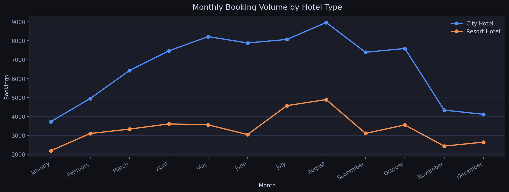
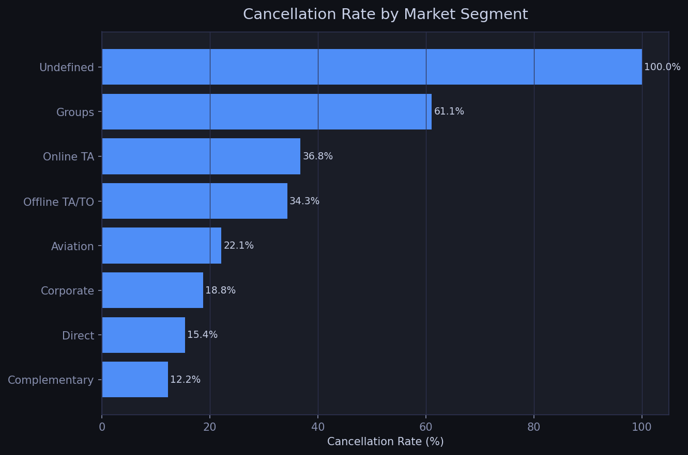
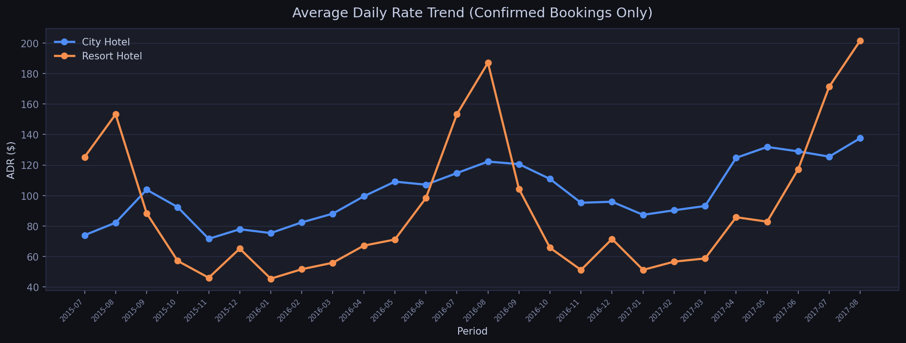
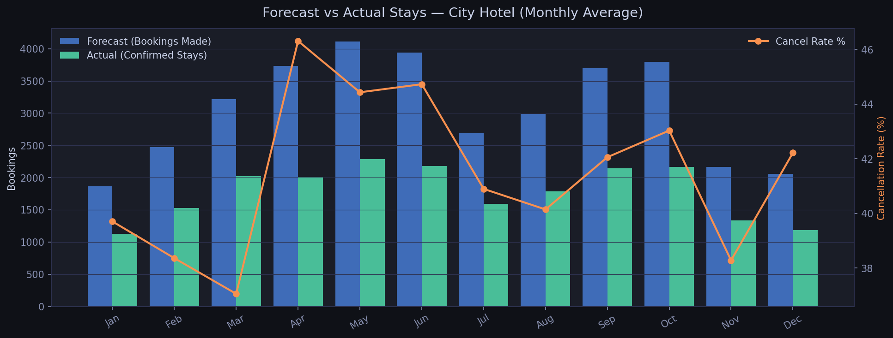

# 🏨 Hotel Booking Demand — Performance Analysis

> A corporate analyst portfolio project demonstrating end-to-end data analysis
> using Python, SQL, and Power BI on real-world hospitality data.

---

## 📌 Project Overview

This project analyzes **119,208 hotel bookings** (2015–2017) across a City Hotel
and Resort Hotel to answer business questions a Corporate Analyst would face daily:

- What are monthly revenue and ADR trends by hotel type?
- Which market segments carry the highest cancellation risk?
- Which distribution channels generate the most revenue?
- How does booking lead time relate to cancellation probability?
- How accurate is a raw booking count as a monthly revenue forecast?

---

## 🗂 Repository Structure

```
hotel-booking-analysis/
│
├── data/
│   ├── hotel_bookings.csv          # Raw dataset (from Kaggle)
│   └── hotel_bookings_clean.csv    # Cleaned & feature-engineered
│
├── notebooks/
│   └── hotel_booking_analysis.ipynb  # Full analysis notebook
│
├── scripts/
│   ├── 01_data_cleaning.py         # Data cleaning & feature engineering
│   ├── 02_eda_visualizations.py    # 6 EDA charts
│   ├── 03_sql_analysis.py          # 7 SQL business queries (SQLite)
│   └── 04_executive_summary.py     # Generates the PDF report
│
├── outputs/
│   └── charts/                     # All generated PNG charts
│
├── docs/
│   └── executive_summary.pdf       # CFO-ready one-page summary
│
├── requirements.txt
├── .gitignore
└── README.md
```

---

## 📊 Key Findings

| Finding | Insight |
|---------|---------|
| **37.1% cancellation rate** | Nearly double the ~20% industry average |
| **Online TA cancels at 36.7%** | Largest volume segment, highest risk |
| **Non-refundable bookings cancel at <1%** | Near-certain revenue |
| **180+ day lead bookings cancel at highest rate** | Discount long-lead bookings in forecasts |
| **Direct channel: highest ADR + lowest cancel rate** | Best margin and most reliable |
| **Resort Hotel ADR peaks $170–200+ in summer** | Seasonal pricing opportunity |

---

## 🛠 Tools & Technologies

| Tool | Usage |
|------|-------|
| **Python / pandas** | Data cleaning, feature engineering, EDA |
| **Matplotlib** | Custom dark-theme visualizations |
| **SQL (SQLite)** | 7 business queries — same logic runs in SQL Server / PostgreSQL |
| **Power BI** | 3-page interactive dashboard (see `/docs` for setup guide) |
| **ReportLab** | Programmatic PDF generation |

---

## 🚀 How to Run

### 1. Clone the repo
```bash
git clone https://github.com/YOUR_USERNAME/hotel-booking-analysis.git
cd hotel-booking-analysis
```

### 2. Install dependencies
```bash
pip install -r requirements.txt
```

### 3. Download the dataset
Download `hotel_bookings.csv` from [Kaggle](https://www.kaggle.com/datasets/jessemostipak/hotel-booking-demand)
and place it in the `data/` folder.

### 4. Run the scripts in order
```bash
python scripts/01_data_cleaning.py
python scripts/02_eda_visualizations.py
python scripts/03_sql_analysis.py
python scripts/04_executive_summary.py
```

### 5. Or run everything in the notebook
```bash
jupyter notebook notebooks/hotel_booking_analysis.ipynb
```

---

## 📈 Sample Charts

| Monthly Bookings | Cancellation by Segment |
|:-:|:-:|
|  |  |

| ADR Trend | Forecast vs Actual |
|:-:|:-:|
|  |  |

---

## 📄 Executive Summary

A CFO-ready one-page summary with KPI tables and actionable recommendations
is available in [`docs/executive_summary.pdf`](docs/executive_summary.pdf).

---

## 📋 Data Source

**Hotel Booking Demand Dataset**
- Source: [Kaggle — Jesse Mostipak](https://www.kaggle.com/datasets/jessemostipak/hotel-booking-demand)
- Original paper: *Hotel Booking Demand Datasets* (Antonio, Almeida & Nunes, 2019)
- 119,390 rows × 32 columns | City Hotel & Resort Hotel | 2015–2017

---

## 👤 Author
Shaonli 
Skills demonstrated: data cleaning · SQL · EDA · dashboard design · financial reporting · forecasting
